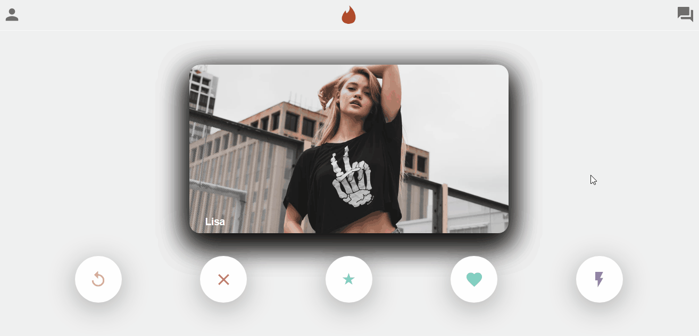

# MERN-Tinder-clone

## Demo 📸

 

## 📜 About the Project

Project made for study purposes, the idea was to create a project as simple as possible using the MERN stack (mongodb, express, react and node.js) to learn more about backend and frontend connections with the backend. 

### 🛠 Technologies

<li><a href="mongodb.com">MongoDB</a></li>
<li><a href="https://expressjs.com">Express.js</a></li>
<li><a href="https://reactjs.org">React.js</a></li>
<li><a href="https://nodejs.org/en/">Node.js</a></li>
<li><a href="https://github.com/axios/axios">Axios</a></li>
<li><a href="https://material-ui.com/pt/">Material-UI</a></li>

## 💻 How to run the application

#### Pre-requisites:
You must have the tools installed:  <a href="">Git</a>, <a href="">Node.js</a>.

<pre>
# In the terminal, clone the project:
$ git clone https://github.com/Wesley-wsl/portfolio.git

# Enter the project:
$ cd mern-tinder-clone

# Enter Front-End
$ cd tinder-clone

# Install dependencies:
$ yarn install
ou
$ npm install

# Start Front-End
$ yarn start
ou
$ npm run start

# Enter Backend
$ cd..
$ cd backend

# Install dependencies:
$ yarn install
ou
$ npm install

# Start Backend
$ nodemon server.js
ou 
$ node serve.js

</pre>

Okay, now you can access the application from the route:  <a href="https://localhost:3000/">https://localhost:3000/</a>
